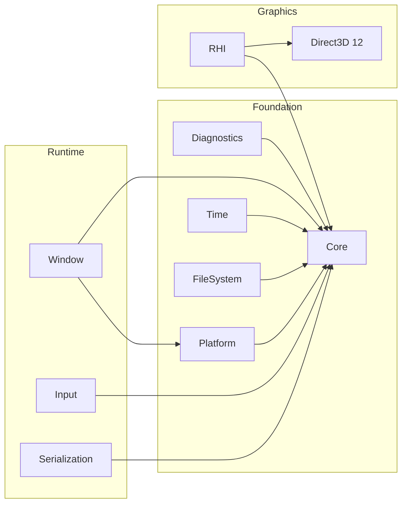
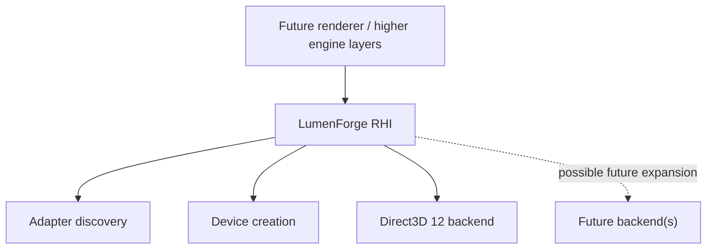

# LumenForge Engine — Architecture Overview

LumenForge is being developed as a modular native engine with explicit subsystem boundaries, failure contracts, and testable interfaces.

## Current integrated architecture

## Core

The current Core layer provides foundational types and low-level contracts used by other systems, including fixed-size type aliases, explicit error/result handling, span/string-view utilities, hashing, UUID support, and input-event sink contracts.

## Diagnostics

Diagnostics establishes explicit assertion/failure behavior and diagnostic types rather than allowing subsystem failures to become implicit.

## Platform

The current bring-up target is Windows 11 x64. Platform-specific implementation is kept behind engine-facing contracts so later platform work does not need to leak directly into higher systems.

## Time and FileSystem

Time provides high-resolution platform timing. FileSystem provides the current native file-operation foundation. Both are low-level services intended to support higher runtime, asset and tool layers.

## Window and Input

The Window subsystem owns native lifecycle behavior and event pumping. Input consumes neutral events/state rather than making higher engine code depend directly on Win32 input representation.

## Serialization

The current serialization work establishes versioned binary-reference encoding/decoding and migration foundations. It is a prerequisite for durable engine data evolution, not a claim of a complete asset or scene format.

## Render Hardware Interface

The RHI introduces backend-neutral concepts such as backend identity, adapter identity/information, queue capabilities, device-creation descriptors, and explicit device-creation failure classes.

The currently integrated concrete backend is Direct3D 12.

## Architectural principles visible today

- **Explicit boundaries** — platform/backend-specific code is isolated behind engine contracts.
- **Explicit failure** — operations use structured result/error paths instead of assuming success.
- **Testability** — public contracts and negative paths are tested as milestones are integrated.
- **Staged growth** — higher-level features are not claimed before the supporting low-level contracts exist.
- **No premature stable ABI promise** — current APIs are pre-alpha and may change.

See [docs/architecture/engine-layers.md](docs/architecture/engine-layers.md) for a layer-oriented view.
