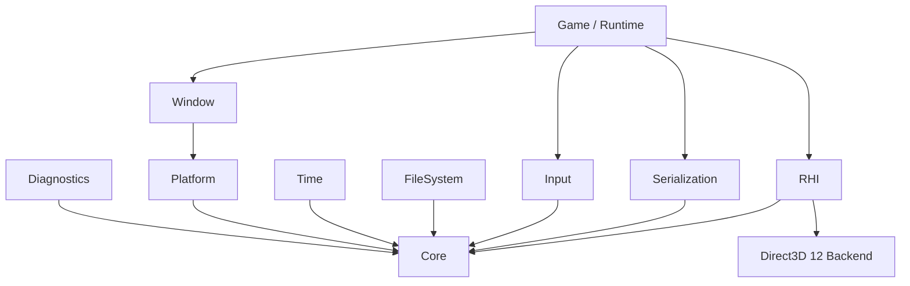

# LumenForge Engine

**LumenForge Engine** is a proprietary C++20 game engine in active pre-alpha development, built in measurable stages from native platform foundations toward a complete game-development runtime and toolset.

> **Public showcase repository.** The complete engine source, experimental branches, proprietary tooling, and development infrastructure remain private. This repository documents externally meaningful, verified progress.

## Current verified baseline

**E1-M02 — RHI Contract Foundation + Direct3D 12 Bootstrap**

| Area | Public status |
| --- | --- |
| C++20 / CMake bootstrap | ✅ Integrated |
| Core types, errors, Result, views, hashing, UUID | ✅ Integrated |
| Diagnostics and fail-fast contracts | ✅ Integrated |
| Windows platform abstraction | ✅ Integrated |
| High-resolution time | ✅ Integrated |
| File system foundation | ✅ Integrated |
| Versioned binary serialization | ✅ Integrated |
| Native window lifecycle | ✅ Integrated |
| Input event/state handling | ✅ Integrated |
| Backend-neutral RHI contracts | ✅ Integrated |
| Direct3D 12 adapter/device bootstrap | ✅ Integrated |
| Swapchain / presentation | ◻️ Not part of the verified public baseline yet |
| Full renderer / scene / editor / physics / audio | ◻️ Planned future work |

LumenForge is **not production-ready** and currently makes no parity claim with Unreal Engine, Unity, or other mature engines.

## What is LumenForge?

LumenForge is being built for two complementary goals:

1. **Internal game development** — a native engine for games developed in the LumenForge ecosystem.
2. **Future external licensing** — a potential commercial engine/SDK offering for developers and studios.

The commercial model, pricing, source-access tiers, and redistribution rights are intentionally undecided while the engine is still pre-alpha. See [COMMERCIAL.md](COMMERCIAL.md).

## Architecture at a glance



Read the detailed overview in [ARCHITECTURE.md](ARCHITECTURE.md).

## Development timeline

| Date | Milestone |
| --- | --- |
| 2026-09-13 | E0-M00 — executable/bootstrap foundation |
| 2026-09-13 | E0-M01 — LFCore foundation |
| 2026-09-13 | E0-M02 — LFDiagnostics |
| 2026-09-17 | E0-M03 — Windows x64 platform foundation |
| 2026-09-18 | E0-M04 — time + file system integration |
| 2026-09-19 | Versioned binary serialization foundation |
| 2026-09-19 | Native window lifecycle |
| 2026-09-20 | E1-M01 — event & input loop |
| 2026-09-25 | E1-M02 — backend-neutral RHI contract |
| 2026-09-27 | E1-M02 — Direct3D 12 bootstrap integrated |

See [CHANGELOG.md](CHANGELOG.md) and [docs/milestones](docs/milestones).

## Selected API snapshot

The engine is not a public SDK yet, but these excerpts show the style of the current internal contracts:

```cpp
auto created = lf::window::Window::Create({});
if (created.has_error())
{
    return 1;
}

lf::window::Window window = std::move(created).value();

if (window.Show().has_error())
{
    return 2;
}

while (!window.ShouldClose())
{
    if (window.PumpEvents().has_error())
    {
        break;
    }
}
```

The API is pre-alpha and may change without compatibility guarantees. More selected excerpts are documented in [docs/overview/api-snapshot.md](docs/overview/api-snapshot.md).

## Showcase media

The repository is prepared for real screenshots and development captures in [media](media). Initial useful captures are:

- the native LumenForge window;
- input/window lifecycle behavior where visually useful;
- D3D12 adapter/device bootstrap output;
- the first presented frame once swapchain/presentation is integrated and verified.

No fabricated renderer screenshots or mock feature claims are used here: visual material will represent running engine builds.

## Documentation

- [Project status](STATUS.md)
- [Roadmap](ROADMAP.md)
- [Architecture](ARCHITECTURE.md)
- [Vision & design philosophy](docs/overview/vision.md)
- [Engine layers](docs/architecture/engine-layers.md)
- [Milestone archive](docs/milestones)
- [Development log](docs/devlogs)
- [Commercial direction](COMMERCIAL.md)
- [Security](SECURITY.md)
- [Contributing](CONTRIBUTING.md)

## Repository boundary

This repository is deliberately **not** the canonical engine-source repository. It is the public-facing project surface for documentation, roadmap information, demos, screenshots, selected API examples, and future externally licensed components.

Public visibility does not make LumenForge open source. See [LICENSE.md](LICENSE.md).

---

**LumenForge Engine** — pre-alpha, actively evolving, and documented as verified capability becomes real.
