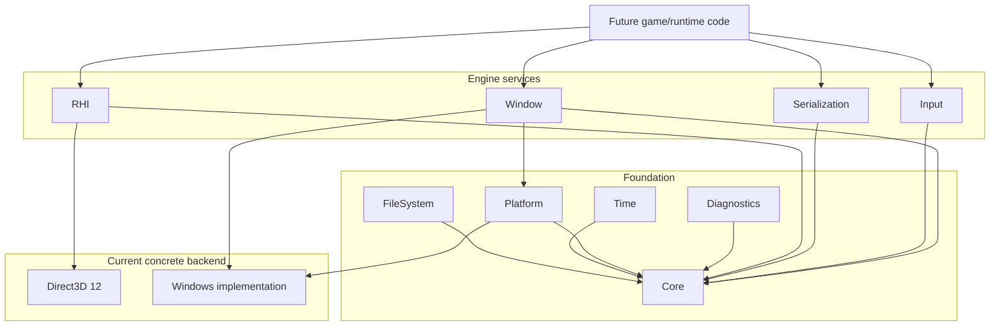

# Engine Layers

This document maps the **currently integrated** public-facing architecture. It does not describe unmerged or private experimental work.

## Foundation responsibilities

**Core** is the shared dependency base. **Diagnostics**, **Platform**, **Time**, and **FileSystem** build specialized low-level services on top of it.

## Runtime-facing services

**Window**, **Input**, and **Serialization** provide the first higher-level native-runtime contracts currently integrated.

## Graphics boundary

**RHI** is intended to keep future renderer code from directly depending on one concrete graphics API. Direct3D 12 is the first integrated backend.

## Deliberately absent from this diagram

A renderer, world/scene system, editor, physics, audio and networking are not shown as implemented layers because they are not part of the current verified baseline.
