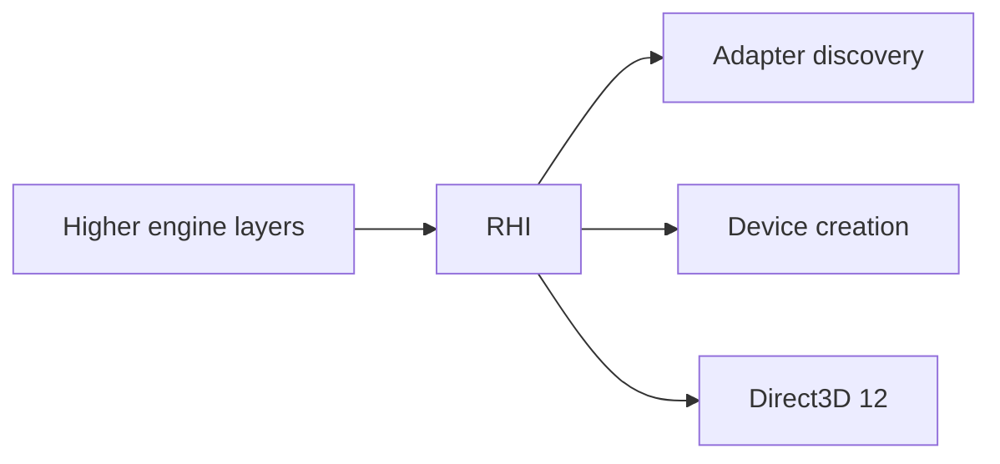

# E1-M02 — RHI Contract & Direct3D 12 Bootstrap

**Integrated:** 2026-09-27  
**Status:** ✅ Current verified public baseline

E1-M02 established the first graphics-hardware boundary and concrete graphics backend bootstrap.

## RHI contract

The integrated RHI defines backend-neutral concepts for:

- backend identity;
- adapter identity and metadata;
- adapter capabilities/limits;
- graphics/compute/transfer queue capabilities;
- device creation descriptors;
- explicit device-creation error classes.

## Direct3D 12 bootstrap

The first concrete backend adds:

- Direct3D 12 backend creation;
- adapter discovery/selection;
- bounded device creation;
- debug-validation capability handling;
- tested failure contracts.

## Architecture

## What this milestone does not claim

It does not yet represent a complete renderer, swapchain/presentation pipeline, material system, shader pipeline, scene renderer or editor viewport.
