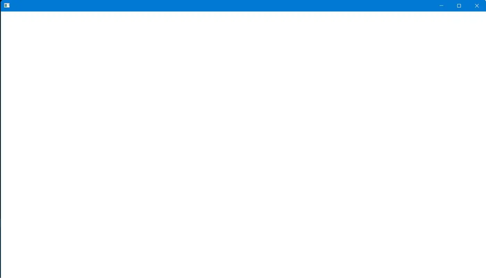
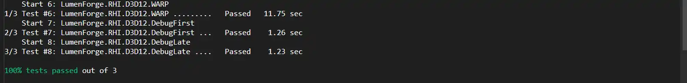

# LumenForge Media

This directory contains **real captures from running LumenForge builds**.

## Current screenshots

### Native Window Lifecycle

First native LumenForge window running on Windows 11.

### Direct3D 12 Validation

The current D3D12 bootstrap validation shows:

- `LumenForge.RHI.D3D12.WARP` — Passed
- `LumenForge.RHI.D3D12.DebugFirst` — Passed
- `LumenForge.RHI.D3D12.DebugLate` — Passed
- 100% tests passed

## Future media

Additional screenshots and demos will be added only when the corresponding capability is integrated and verified. The next major visual target is the first presented D3D12 frame after swapchain/presentation integration.

See [capture-guide.md](capture-guide.md).
